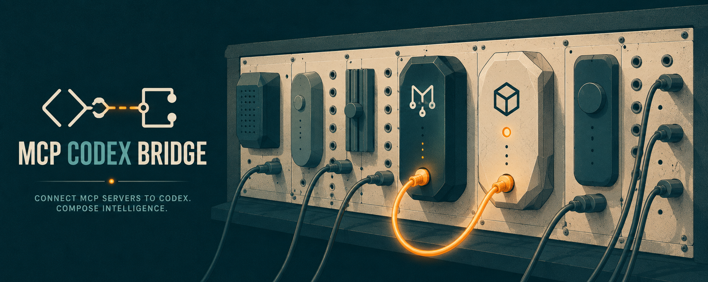

<p align="center">
  
</p>

# mcp-codex-bridge

An MCP server that wraps the [Codex CLI](https://github.com/openai/codex) as four callable tools so Claude Code (or any MCP-aware client) can invoke Codex inline as a critic, second opinion, or implementer. Uses your existing ChatGPT subscription auth via the Codex CLI; no OpenAI API key required, no per-token cost.

## Why this exists

Upping the ante on **The Adversarial Audit**. The original argument: every agentic workflow needs a second agent breaking the first one's work. The sharper version: that critic should come from a totally different provider. Claude reviewing Claude shares too much training DNA to catch what matters. Codex reviewing Claude catches what same-family review rubber-stamps. This server wires up the handoff so it happens as a tool call inside one session.

Background reading: [Wiring Agents to Each Other](https://open.substack.com/pub/jnycode/p/wiring-agents-to-each-other?r=3x6reh&utm_campaign=post&utm_medium=web&showWelcomeOnShare=true) on the 42 Insights Substack.

## What it gives Claude Code

| Tool | What it does | Sandbox |
|------|---------------|---------|
| `codex_status` | Reports CLI version, sign-in state, default model, and configured timeout. Use to fail fast before expensive calls. | n/a |
| `codex_ask` | General-purpose query for a second opinion or analysis. Optional context files are prepended to the prompt. | `read-only` |
| `codex_review` | Adversarial review of a diff or file content. Returns structured BLOCKER / MAJOR / MINOR findings. | `read-only` |
| `codex_implement` | Hands Codex a spec and a working directory; Codex makes the edits itself. | `workspace-write` |

## Requirements

- Node.js 20 or newer.
- Codex CLI installed and signed in. Verify with `codex login status`; it should report `Logged in using ChatGPT`.
- A ChatGPT Plus account or equivalent subscription that the Codex CLI is configured against.

If Codex is missing or not signed in, every tool returns a structured error with the exact command to run.

## Install

```bash
git clone https://github.com/newtro/mcp-codex-bridge.git
cd mcp-codex-bridge
npm install
npm run build
```

The build produces `dist/index.js` with a shebang, ready to be invoked as a CLI.

## Wire it into Claude Code

Claude Code reads MCP servers from `~/.claude.json`. Add this server at **user scope** so it loads in every project:

```bash
# Linux / macOS
claude mcp add-json --scope user codex-bridge \
  '{"type":"stdio","command":"node","args":["/absolute/path/to/mcp-codex-bridge/dist/index.js"]}'

# Windows (PowerShell). Note JSON-escaped backslashes.
claude mcp add-json --scope user codex-bridge `
  '{"type":"stdio","command":"node","args":["D:\\Repos\\mcp-codex-bridge\\dist\\index.js"]}'
```

Verify:

```bash
claude mcp list
# expect: codex-bridge: node /absolute/path/to/dist/index.js
```

In any Claude Code session, `codex_status`, `codex_ask`, `codex_review`, and `codex_implement` will appear under the `codex-bridge` server.

### Alternative: Claude Desktop / generic JSON config

If your client uses a `claude_desktop_config.json`-style file, drop the same entry into its `mcpServers` block:

```json
{
  "mcpServers": {
    "codex-bridge": {
      "type": "stdio",
      "command": "node",
      "args": ["/absolute/path/to/mcp-codex-bridge/dist/index.js"]
    }
  }
}
```

## Environment variables

| Variable | Default | Purpose |
|----------|---------|---------|
| `CODEX_CLI_PATH` | `codex` (resolved on PATH) | Override the Codex binary location, useful when the CLI is installed outside PATH. |
| `CODEX_MCP_TIMEOUT_MS` | `300000` (5 minutes) | Default per-call timeout. Per-call `timeout_ms` argument overrides this. |
| `CODEX_HOME` | `~/.codex` | Directory where Codex stores its `config.toml` and credentials. The bridge reads the configured default model from `$CODEX_HOME/config.toml`. |

## Tool reference

### `codex_status`

No inputs. Returns plain text with CLI version, auth state, default model, default timeout, and warnings if Codex is missing or not signed in.

The `Default model` is whatever string sits in your `~/.codex/config.toml` (the bridge does not interpret or validate it).

### `codex_ask`

```json
{
  "prompt": "string (required)",
  "working_directory": "optional cwd",
  "context_files": ["optional paths read and prepended to the prompt; truncated at 64 KiB each"],
  "timeout_ms": "optional per-call timeout in ms"
}
```

Read-only sandbox. Safe for analysis questions, design discussions, and any prompt where Codex must not touch files.

### `codex_review`

```json
{
  "diff": "string (required) - unified diff or full file content",
  "focus_areas": ["security", "performance", "edge cases"],
  "context": "what the code is trying to do",
  "working_directory": "optional cwd",
  "timeout_ms": "optional per-call timeout in ms"
}
```

Asks Codex to act as an adversarial reviewer. Output is markdown organised as BLOCKER / MAJOR / MINOR / What I checked but found clean / Verdict. This is the core cross-provider audit use case.

### `codex_implement`

```json
{
  "spec": "string (required) - description of what to build",
  "working_directory": "string (required) - absolute path of the repo to modify",
  "files_in_scope": ["optional list of files Codex is encouraged to limit edits to"],
  "approval_mode": "read-only | workspace-write | danger-full-access (default: workspace-write)",
  "timeout_ms": "optional per-call timeout in ms"
}
```

Codex writes the files itself. `workspace-write` is the default so edits actually land; pass `read-only` if you only want a plan, or `danger-full-access` only when Codex needs to run package installs or commands beyond the workspace.

## How error reporting works

Every failure is one of six classes, each with a `userAction` field telling the calling agent what to do next.

| Class | When it fires | What the agent should do |
|-------|---------------|---------------------------|
| `CODEX_NOT_FOUND` | `codex` binary missing or not executable (ENOENT / EACCES). | Install Codex CLI, or set `CODEX_CLI_PATH`. |
| `CODEX_NOT_AUTHENTICATED` | Codex stderr indicates "not logged in" / 401 / similar. | Run `codex login` to sign in with ChatGPT. |
| `CODEX_RATE_LIMITED` | Stderr or event payload contains a rate-limit / 429 / quota message. | Wait and retry, or check ChatGPT plan usage. |
| `CODEX_TIMEOUT` | Subprocess did not complete within the per-call timeout. SIGTERM then SIGKILL after 2 seconds. | Raise `CODEX_MCP_TIMEOUT_MS` or split the request. |
| `CODEX_PARSE_ERROR` | Codex exited 0 but produced no `agent_message` item, or stdout was unparseable JSONL. | Run `codex --version`; the bridge may need updating to match a new event schema. |
| `CODEX_FAILED` | Unrecognised non-zero exit. | Read the surfaced stderr for the underlying Codex error. |

Errors come back as MCP tool results with `isError: true`. The body includes the class tag, the underlying message, the `userAction` string, and any captured stderr.

## Logs

The server writes one JSON object per Codex invocation to its own stderr. Successful calls use `errorClass: "OK"`; everything else uses one of the six classes above.

```json
{"ts":"2026-05-20T08:45:35.219Z","tool":"codex_review","durationMs":12340,"exitCode":0,"errorClass":"OK","argSummary":{"cwd":null,"sandbox":"read-only","model":null,"promptChars":1234,"timeoutMs":300000,"skipGitCheck":true,"addDirs":0}}
```

Claude Code surfaces these via `/mcp`. Downstream log aggregators can parse them as JSON lines without a custom format. Prompt content never appears in logs; only the character count.

## Development

```bash
npm install
npm run build              # tsc -> dist/
npm test                   # unit suite (fake spawn; 40 tests in ~330 ms)
npm run test:integration   # exercises a real Codex CLI; requires sign-in
node tests/smoke-tools-list.mjs   # quick MCP-protocol smoke check
node tests/manual-verify.mjs      # exercises all 4 tools end-to-end and rewrites docs/manual-verification.md
```

## Manual verification log

A live transcript of all four tools running against a real Codex CLI is at [docs/manual-verification.md](docs/manual-verification.md). It is regenerated by `node tests/manual-verify.mjs` and serves as the proof that the integration is working end to end.

## ADR

Architectural decisions (subprocess over API, four-tool surface, error classification, stack choices, prior art evaluation) are recorded in [docs/adr/0001-codex-mcp-bridge.md](docs/adr/0001-codex-mcp-bridge.md).

## Related reading

- [Wiring Agents to Each Other (42 Insights, Substack)](https://open.substack.com/pub/jnycode/p/wiring-agents-to-each-other?r=3x6reh&utm_campaign=post&utm_medium=web&showWelcomeOnShare=true): the cross-provider adversarial audit argument that motivated this bridge.
- [Model Context Protocol](https://modelcontextprotocol.io): the open standard this server speaks.
- [Codex CLI](https://github.com/openai/codex): the upstream tool this bridge wraps.

## License

MIT.
